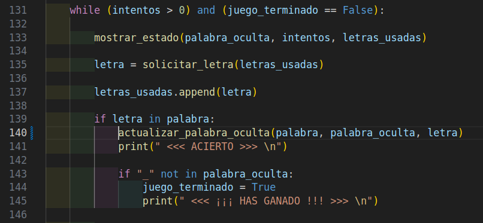
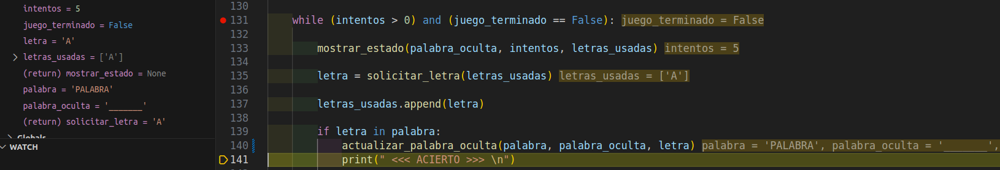
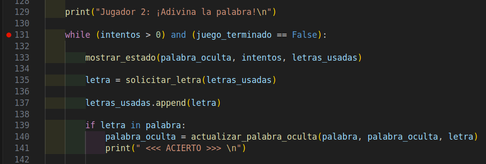

# - Depuración aplicada en el juego "ahorcado"

En mi caso, siendo totalmente honesto, no he tenido que usar mucho el debugger, pero he de admitir que en una ocasión me salvó.

Una vez tenía todo montado en la función `jugar()`, el bucle principal del flujo del juego, la palabra oculta no se me actualizaba en ningún momento.

Busqué el fallo visualmente, y no había manera de encontrarlo a pesar de ser una tontería. Por lo que decidí depurar, encontrándolo así más fácilmente.

### Fallo encontrado:

En el bucle principal del juego, cuando toca actualizar la palabra oculta en caso de acierto, realmente no estaba actualizando nada. Simplemente estaba llamando a la función `actualizar_palabra_oculta()` pero no estaba asignándole dicho cambio a ninguna variable, por lo que no estaba siendo actualizada en ningún momento.

Lo cual en el debugger de visual studio code aparecía de la siguiente manera:

Me marca claramente que al supuestamente "actualizar la palabra oculta", dicha palabra no está siendo actualizada a pesar de haber acertado la letra. 

### Solución al fallo:

Para solucionar dicho error, una vez localizado, fui al código del archivo `ahorcado.py` a su respectiva línea e igualé la variable a la función para que sí que se almacenara dicha actualización.

De esta manera, mi programa del juego ahorcado funciona correctamente.